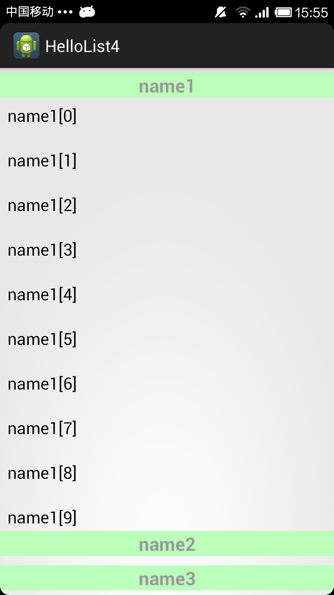

PinnedHeaderBottomList
======================

Demo from the Android Source code, make it can run independable.

The whole source code can be download at:
https://android.googlesource.com/

This is from the Sample of Contacts:
https://android.googlesource.com/platform/packages/apps/Contacts/

The key classes are taken out for a single demo: the pinned header and bottom ListView.
The ListView has a few sections and each of them has a header view.

The ListView that maintains headers pinned at the top of the list.
When pushed up, the headers pinned at the top and list in their order.
When pushed down, the heeader pinned at the bottom and in their order, too.

